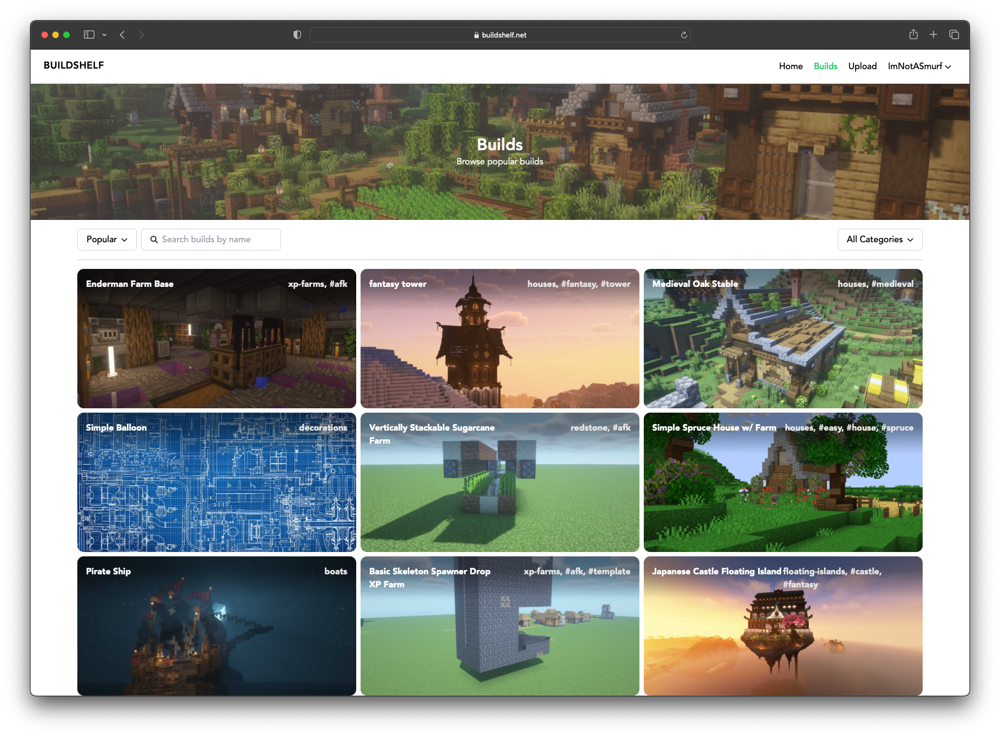
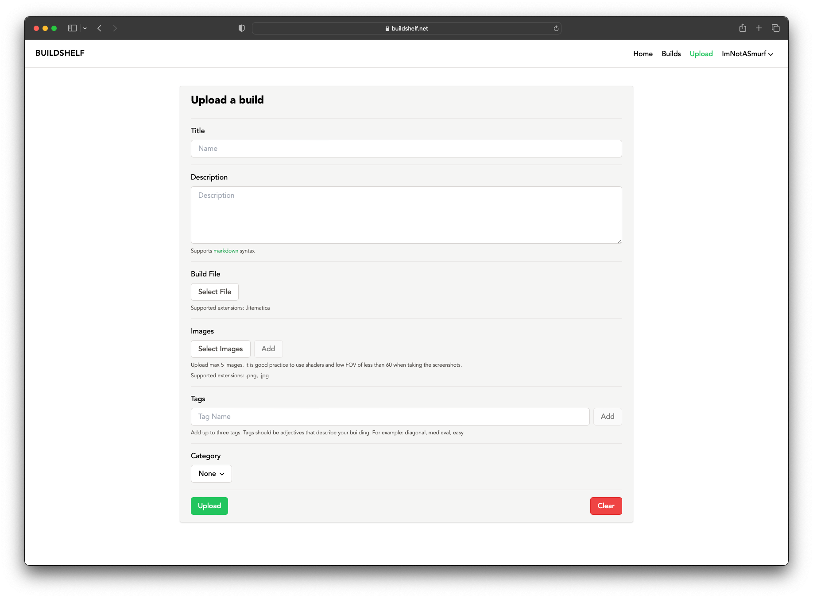

# Buildshelf

Work-in-progress website that allows users to upload and share their creations in
a popular block game called Minecraft.
To upload builds, users can log in with a microsoft account that has a minecraft account linked to it.

Frontend has been built with Next.js and backend with Express.js and Sequelize.
Postgresql is used as the database, and files are stored using Multer.

Can be found live at [buildshelf.net](https://buildshelf.net).

## Building
The project runs via Docker. Get started with
`docker-compose up --build`

To seed the database with test data, run
`npm run seed` inside `backend/`

To deploy the website to production, run
`docker-compose -f docker-compose-prod.yml up --build`

## .env
Create a `.env` file in the root directory of the project.
Docker will use this file to set environment variables.
To get Microsoft authentication working, you need to
create an app registration in
[Azure Portal](https://portal.azure.com).
```
DB_URL=postgres://post:post@db/post
BACKEND_ENDPOINT=http://localhost:9000/api
FRONTEND_ENDPOINT=http://localhost:3000
JWT_SECRET=yoursecret

MICROSOFT_CLIENT_ID=
MICROSOFT_CLIENT_SECRET=
```

## Screenshots

### <center>Frontpage</center>


### <center>Builds page</center>


### <center>Upload page</center>


### <center>Profile page</center>

